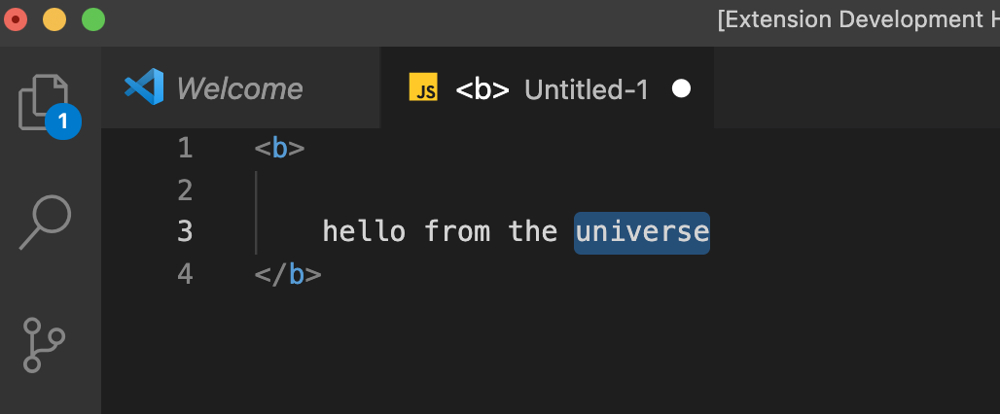
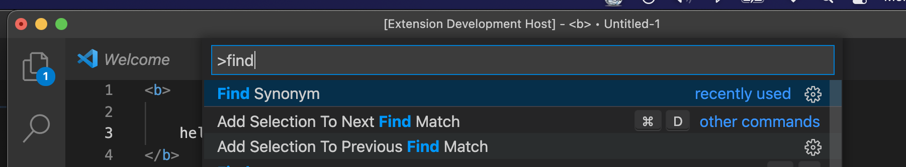
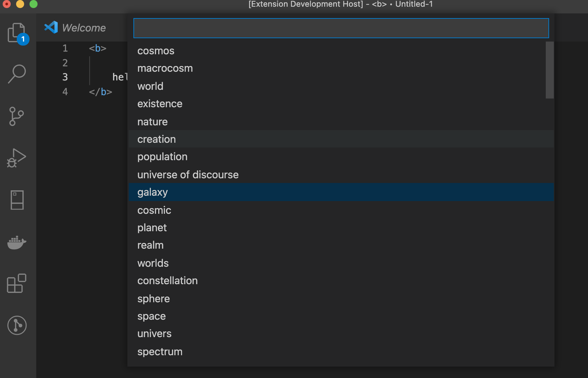
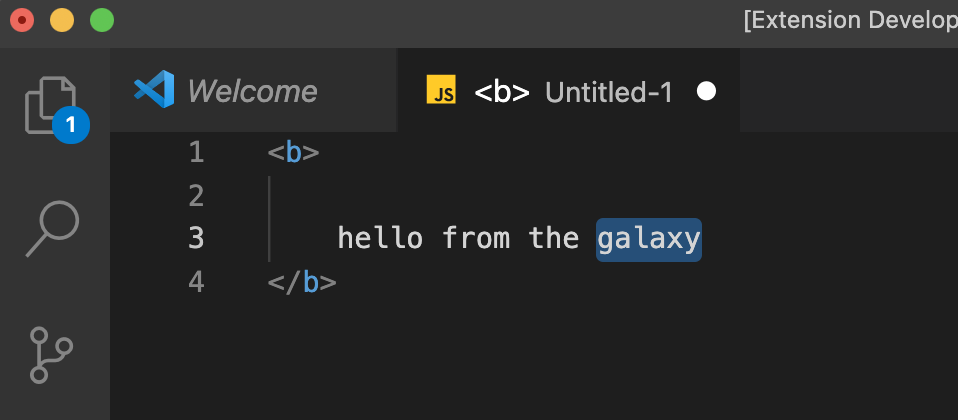

# Tchitos findsyn README

I'm using the [datamuse](https://api.datamuse.com) API in order to search and replace the selected word from the editor with its synonym

## Follow these steps:

    1. Select the text 

        
    2. open command palette 
        - for Mac : Cmd+Shift+P 
        - for Windows : Ctrl+Shift+P 
        
    3. search for "Find Synonym"

        
    4. Select the synonym to replace 

    5. Et voila 

